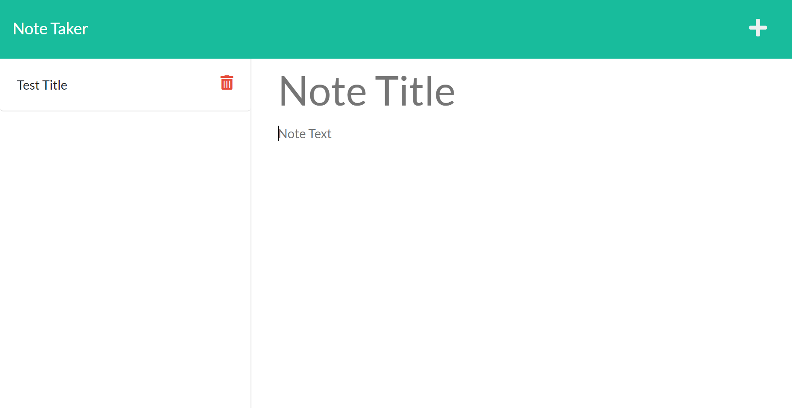

# NoteTakerPRO

An simple express app for taking notes using api calls to populate the sidebar with past notes made by the user and an ability to add to that database of notes through a post and once the page is rerendered that note will also be rendered from the database in the sidebar.

## Deployment

[Click Here if you are interested in trying the applications deployment](https://notetakerpro.herokuapp.com/notes)

## Screenshot

## Motivation

This app is a good way for me to demonstrate my ability to code in JS as well as making calls to a database to populate a front end with data. It was also a good practice of taking an almost complete application to find where changes needed to be made in order to get the app in working order.

## Contributor

https://github.com/mhengerer
